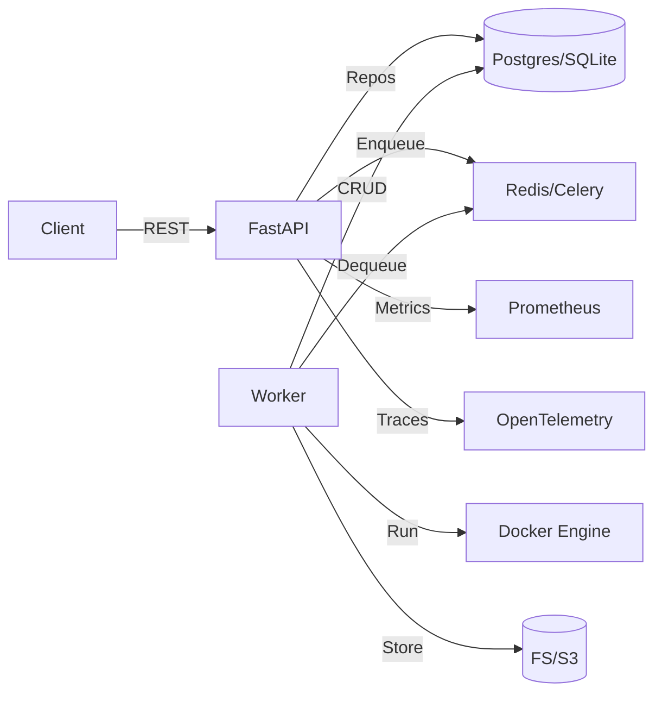
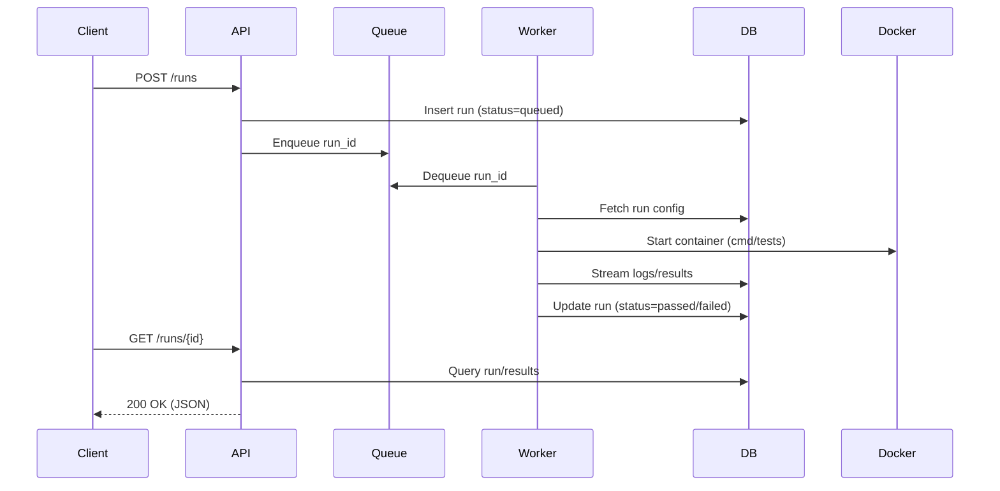

# Project Design: test@#$%

## Architecture Overview

Pattern: Hexagonal (Ports and Adapters) layered over a modular monolith. Easy to split into services later if needed.
Data/control flow (typical run)
1) Client creates a TestRun via POST /runs with references to TestSuite/Environment.
2) API validates, persists run, enqueues job to a queue.
3) Worker pulls job, prepares container image, runs test command, captures logs/results.
4) Worker writes incremental logs/artifacts and final results to DB/storage.
5) API exposes GET /runs/{id} for status, results; optional websocket for live logs.
6) Notifications emitted when run completes/fails.
Mermaid component diagram:

Sequence for a run:

## Tech Stack

- Language: Python (as specified)
- Justification: Rich testing ecosystem (pytest, hypothesis), excellent async/web support (FastAPI), strong community.
- Web/API framework: FastAPI
- Pros: Async-first, Pydantic models, automatic OpenAPI docs, good performance, active community.
- Alternatives: Flask (simpler, less opinionated), Django (batteries-included, heavier).
- Data modeling and ORM: SQLAlchemy 2.x + Pydantic
- Rationale: Mature ORM, solid migrations through Alembic, Pydantic for request/response models.
- Alternative: SQLModel (highly ergonomic; built on SQLAlchemy + Pydantic; fine for MVP).
- Database
- MVP: SQLite (zero-ops, easy local dev).
- Production: PostgreSQL (transactions, concurrency, JSONB support, extensions).
- Rationale: Start fast, migrate smoothly.
- Background jobs / task queue
- MVP: FastAPI BackgroundTasks (simple, limited).
- Production: Celery or RQ with Redis
- Celery: Feature-rich, robust scheduling/retries/chords.
- RQ: Simpler, easier onboarding.
- Rationale: Offload long-running/IO-bound test execution from API.
- Containerization/sandboxing
- Docker for executing tests in isolated environments (non-root, resource limits).
- Rationale: Reproducibility, security boundaries, dependency isolation.
- Caching/message broker
- Redis: job queue + caching run metadata.
- Alternative: RabbitMQ (for Celery broker), but Redis is simpler initially.
- Observability
- Logging: structlog or standard logging with JSON formatter.
- Metrics: prometheus-client.
- Tracing: OpenTelemetry SDK (OTLP exporter).
- Rationale: Essential for diagnosing flaky/bursty workloads.
- Packaging and tooling
- Dependency management: Poetry (lockfile, scripts) or uv (fast, modern).
- Lint/Format: Ruff, Black, isort.
- Type checking: mypy or pyright.
- Pre-commit hooks: pre-commit.
- Testing
- pytest, pytest-asyncio, hypothesis (property-based), pytest-cov.
- Security
- Auth: OAuth2/JWT with FastAPI’s utilities; scope-based permissions.
- Static analysis: bandit.
- Secrets management: dotenv locally, environment variables in CI/CD, optional Vault/SOPS later.
- Documentation
- OpenAPI generated by FastAPI; mkdocs-material or Sphinx for project docs.
- Start simple (SQLite, BackgroundTasks), evolve to robust (Postgres, Celery/Redis) without architectural rework.
- Strong typing and automated checks maintain code health as complexity grows.
- Observability baked in to scale confidently.
- --
